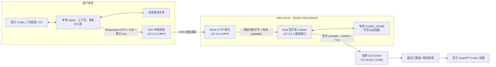
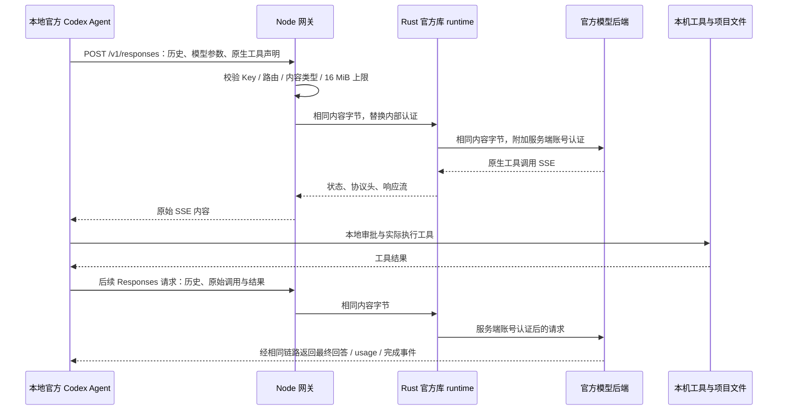

# Codex Official Bridge 架构

本文依据 2026-09-16 的实现和当日验收记录编写，说明默认 `native` 模式。部署状态是当日快照，后续运行状态仍须现场核验。日常操作见 [deployment.md](deployment.md)，验收证据见 [validation.md](validation.md)，构建细节见 [native-build.md](native-build.md)。

本轮交接指定仓库为 [LiuShenXi/codex-official-bridge](https://github.com/LiuShenXi/codex-official-bridge)，分支 `main`。服务器 `/opt/codex-official-bridge` 是部署副本，没有 `.git`；提交和推送源码不会自动更新运行容器，也不能在该目录直接执行 `git pull`。

## 1. 目标、方案与服务边界

目标是让本地官方 Codex 桌面或 CLI 继续管理任务、上下文、项目文件和工具执行，模型通信经服务器上的专用官方账号完成。客户端只需要网关 Key，不需要持有服务端账号的 OAuth 凭据。

当前方案把服务器的职责限制在 HTTP 传输和认证：Node 校验网关 Key、检查路由和请求大小；私有 Rust 进程调用固定版本的官方认证、provider 和 HTTP 库，连接官方 Codex 后端。服务器不创建 Agent 回合，不注册客户端工具，不把上下文重新组织成普通聊天提示词。

Rust runtime 是本项目编写的独立可执行程序，链接公开的官方 Codex 库。它不是未修改的官方 CLI，也不等同于运行整个官方 Agent。原始协议保留降低了适配层丢失工具、上下文和未知字段的风险，但不能证明模型质量不变、账号不会限流，或多人分发行为不可检测。

当前部署包含一个账号、一个 Rust runtime、一个网关 Key。客户端可能同时建立多个请求，但服务没有用户识别、请求排队、并发配额、账号池或自动切换账号的实现。

早期 `legacy` 模式仍保留在代码中。它通过服务端官方 app-server 和 dynamicTools 桥接函数调用，受工具与上下文子集限制；它不是现在桌面二号使用的通路。尤其不能将 legacy 的单会话限制、函数转换、`usage:null` 或 compact 501 行为套用到 native 模式。历史方案见 [legacy-bridge.md](legacy-bridge.md)。

## 2. 实际部署链路

服务器项目位于 `/opt/codex-official-bridge`。Compose 使用 host network，但 Node 和 Rust 都只绑定回环地址，不向公网网卡开放模型端口。Rust 端口每次启动随机选择，不能把某次观察到的进程 PID、端口或 TCP 连接写入固定配置。

本机 LaunchAgent `com.monas.codex-official-bridge-tunnel` 维护 SSH 转发。桌面二号使用独立 provider `official_bridge`，地址为 `http://127.0.0.1:8879/v1`；一号配置不依赖该服务。

出口复用主服务器现有隧道，经 BWH 静态家宽连接官方后端。当前容器内 Rust HTTP 工厂实测出口为 `72.253.169.123`；独立测试容器把代理设为无效地址时请求失败，没有回退直连。这个结论适用于当前 Compose 环境，不代表任意环境运行 runtime 都会强制走代理。

## 3. 启动、运行与退出

`src/main.mjs` 读取运行配置，默认选择 `BRIDGE_MODE=native`。启动顺序如下：

1. 检查网关 Key，建立运行目录、空工作目录和专用认证目录的路径。
2. Node 在私有运行目录建立临时控制目录，使用 `spawn` 启动 Rust；不经过 shell，不传入网关 Key。
3. Rust 通过官方 `AuthManager` 读取专用文件认证，确认是可由本程序维护的 ChatGPT 登录模式，并建立固定的官方 provider 和 HTTP client。
4. Rust 绑定随机回环端口，生成 32 字节随机 capability。它将端口和 capability 写入权限 0600 的临时控制文件，`sync_all` 后原子重命名为就绪文件。
5. Node 检查控制文件类型、权限、大小、端口和 capability 格式；读取后再次核验子进程没有退出，才对外监听网关端口。

控制 capability 与客户端网关 Key 是不同的凭据。前者只供 Node 调用当前 Rust 进程；后者只用于本机客户端访问 Node。控制文件含秘密，不能上传到代码仓库或贴到诊断输出。

`GET /healthz` 返回 Node 看到的 runtime 存活状态，例如 native 模式、HTTP/SSE 和工具在客户端执行。它不发送模型请求，因此不能单独证明账号、上游模型或出口此刻可用。

Rust 意外退出时，Node 关闭服务并以非零状态退出，让 Docker 的 `restart: unless-stopped` 重新启动整个服务。正常 SIGINT/SIGTERM 走关闭流程：停止接收新连接、关闭 runtime、清理连接与控制目录；Rust 超过 2 秒仍未退出会被 Node 强制终止。Compose 的容器停止宽限为 20 秒，不能把它视为所有在途模型请求都能完成的保证。

## 4. 一个原生工具回合怎样完成

工具声明可以是 `function`、custom/freeform、namespace，或 Sol 在 `input` 中携带的 `additional_tools`。网关不会把它们全部改成函数，也不会自行执行 `exec`、`apply_patch`、浏览器或应用工具。

每次工具续接由客户端重新提交协议所需的历史、调用和结果。网关不维护 `call_id` 映射、不生成第二套 `previous_response_id`、不创建服务端对话状态。客户端传来的加密推理字段、内部消息元数据、工具返回数组、未知字段和模型参数都保留在原始请求体内。

这不意味着项目文件永远不离开本机。工具在本机运行，但客户端提交给模型的文件片段、工具输出和上下文会经过网关并发送上游；它们属于模型请求数据。

## 5. HTTP、SSE 与请求体压缩合同

### 5.1 固定路由

| 客户端路由 | Rust 固定官方路径 | 行为 |
| --- | --- | --- |
| `POST /v1/responses` | `/responses` | 原始请求体和上游响应流；包含普通推理、工具续接和 V2 压缩 |
| `POST /v1/responses/compact` | `/responses/compact` | 旧 unary 路由及其错误原样转发；本次真实上游返回 404 |
| `GET /v1/models?client_version=…` | `/models?client_version=…` | 原样返回官方 Codex 模型目录 |
| `GET /healthz` | 不访问上游 | 网关鉴权后的 runtime 存活检查 |

官方 base URL 固定为官方库提供的 `CHATGPT_CODEX_BASE_URL`，当前为 `https://chatgpt.com/backend-api/codex`。provider 对路径首尾斜杠的拼接与官方客户端一致。只有 models 路由允许查询参数，查询参数不能选择另一个上游主机或路径。未知方法、路径和 Responses 查询参数被拒绝；服务不是任意 URL 代理。

### 5.2 “原始字节”具体指什么

Node 在转发前完整读取请求体，按收到的字节数执行 16 MiB 上限，不解析 JSON；Rust 也以 16 MiB 上限接收内容并使用官方 `Request::with_raw_body`。因此这是**缓冲请求、流式响应**，不是上传体到上游的逐块直通。

保留的是 HTTP 消息体内容字节和协议字段。HTTP 分块边界、TCP 包边界、连接、Host、Content-Length 和认证头可以按当前这一跳重新生成，不能声称整个网络报文逐字节不变。对于压缩请求，上限按压缩后的收到字节计算；网关不解压、不重复压缩，也不按 JSON 重序列化。

POST 仍要求 `Content-Type: application/json`，即使内容字节已经压缩。`Content-Encoding` 随原始内容保留。Rust 禁止 reqwest 的 gzip/brotli/deflate/zstd 自动解压和自动 HTTP 重定向，使压缩响应、非 2xx 状态及其响应体保持可见。

SSE 不经过事件解析器或重新编码：Rust 使用 `bytes_stream`，Node 使用 `pipeline` 传递背压。网关不添加新的 `response.completed`、不合成工具事件、不改写 usage，也不要求它认识所有未来新增事件。native 模式没有 legacy 的自制 SSE 心跳或事件转换。

二号当前关闭 `enable_request_compression`，减少接入变量；原始压缩体的转发能力已有离线测试，但没有据此宣称当前桌面所有真实压缩场景均已验收。

### 5.3 头部处理与优先级

| 头部类别 | 处理 |
| --- | --- |
| 网关 `Authorization` | 仅 Node 用于验证客户端 Key，随后移除 |
| 上游账号身份 | 客户端的 authorization、cookie、api-key、x-api-key、ChatGPT account/user、OpenAI organization/project、actor authorization、FedRAMP 标志等被剥离；由官方认证库提供服务端身份 |
| 内部 capability | 外部同名头被移除；Node 注入 `x-codex-runtime-token`，Rust 验证后不再向上游发送 |
| Hop-by-hop | Connection、Keep-Alive、Proxy-Authorization、TE、Trailer、Transfer-Encoding、Upgrade 等及 Connection 点名的字段被移除 |
| Host / 请求 Content-Length | 不继承外部 Host；每一跳根据固定地址和实际内容生成长度 |
| 原生协议元数据 | version、session/thread、turn state、Responses lite、Content-Encoding 等未列入排除项的字段保留 |
| 上游响应 | 状态、Content-Type、Content-Encoding、Content-Length、Retry-After、协议元数据和响应内容保留；认证、cookie 和 hop-by-hop 头不返回客户端 |

Rust 的实际合并顺序是 provider 默认头 → 过滤后的客户端协议头 → 官方认证头；HTTP client 的默认 User-Agent/originator 在请求未提供时生效。账号身份不依赖客户端可覆盖的默认头。provider 的环境 organization/project 注入被关闭，避免宿主环境替换专用账号的路由身份。

## 6. 上下文压缩与客户端 provider 配置

“HTTP 请求体压缩”和“上下文压缩”是两件事。前者改变编码，后者改变客户端后续发送的上下文历史。

固定官方版本下，自定义 provider 的 `name = "OpenAI"` 影响 OpenAI 专有字段保留和远程上下文压缩能力。二号使用独立 ID `official_bridge`，同时保留该名称。`requires_openai_auth=false` 让本地请求使用配置的网关 Key；`supports_websockets=false` 将这个 provider 限制为 HTTP/SSE，不改变一号 provider。

该版本 `features.remote_compaction_v2` 默认 true。provider 声明 V2 能力且此功能开启时，客户端在完整 `input` 末尾追加 `{"type":"compaction_trigger"}`，经普通 `/responses` 发起流式压缩。它等待恰好一个 `compaction` 输出项以及 `response.completed`，再由本地客户端安装压缩后的历史。`token_budget` 功能有独立优先分支；不能随意改动开关后仍假定走相同路径。

真实验收通过官方 app-server 调用 `thread/compact/start`：先记忆随机 nonce，完成 contextCompaction 后再准确回忆。服务端不需要理解或生成该控制项。该结果证明当前 V2 通路可用，不是对任意长度任务的压力或质量测试。

旧 `/responses/compact` 在代码中仍有原样转发路由，但本次官方响应为 404；URL 拼接已核对无误。不能把路由存在或离线替身成功写成旧接口可用，也不应把这个上游 404 变成虚假的成功响应。

## 7. 账号状态、隔离与刷新

服务器是专用账号认证状态的活动维护端。Docker 把服务器 `.runtime/codex-home` 可写挂载到 `/var/lib/codex-auth`，`CODEX_HOME` 指向这里。文件认证模式由官方 `AuthManager` 读取和更新；镜像中不包含账号文件，也不包含用于初次登录的官方 CLI。

初次浏览器登录在容器外通过官方 CLI 完成，再以私有方式交付专用状态目录。旧本机 legacy 实例已停止，避免多个活动进程分别持有旧认证副本并争用刷新状态。不要用较早的本地认证备份覆盖服务器已经刷新的文件来“回滚服务”。

Node 启动 Rust 前会删除 `BRIDGE_*`、父进程 Codex 会话变量和显式上游认证/地址覆盖，保留需要的网络代理、CA 配置和专用 `CODEX_HOME`。Rust 还拒绝 refresh/revoke endpoint、API key、access token 等环境覆盖，并确认启动认证属于 `CodexAuth::Chatgpt`。

运行时使用 `auth_provider_from_auth_manager`，每次请求解析当前认证。官方实现以启动时账号 ID、ChatGPT 用户 ID 和 workspace 属性为身份锚点：同一账号刷新后能使用新 token；另一个账号不能静默接管现有 runtime 的账号状态。换账号属于运维操作，需要明确的生命周期切换，当前没有自动账号池。

上游在响应开始前返回 401 时，使用官方 `unauthorized_recovery`，依次尝试账号匹配的磁盘 reload 和 OAuth refresh，每次成功后重新构造请求、重新附加认证。步骤耗尽或恢复失败后保留上游失败。runtime 不因 429、5xx、连接结果不明或 SSE 中断自动重放模型请求；客户端自己的重试仍由官方客户端控制。

## 8. 错误、超时、取消与可观测性

### 8.1 错误来源不能混淆

| 来源 | 当前行为 |
| --- | --- |
| 浏览器 Origin 请求 / 网关 Key 无效 | Node 返回 403 / 401 |
| 不合法请求目标 / 不支持路由 | Node 返回 400 / 404 |
| POST 内容类型不支持 / 请求过大 | Node 返回 415 / 413；chunked 超限有回归验证 |
| Rust 不可用 | Node 返回 503；runtime 退出会触发整个服务退出重启 |
| Node 到 Rust 传输失败或转发期限到达 | 未发响应头时返回本地 502；已开始响应时断开流，不追加第二个 JSON 响应 |
| Rust 的认证解析、请求准备或上游传输失败 | 固定错误码的本地 502，不输出认证或原始诊断文本 |
| 官方 HTTP 错误和模型 SSE 错误 | native 路径保留原始状态、协议头与内容；401 恢复是上述受控例外 |

legacy 的 `turnErrorToBridgeError` 映射不参与 native 上游流处理。看到 429/503/404 时应先区分上游响应与网关合成错误，不要根据一个状态码推断账号风控原因。

### 8.2 时间边界

| 项目 | 当前值与含义 |
| --- | --- |
| Node 接收请求头 | 15 秒 |
| Node 接收完整客户端请求 | 30 秒；与模型生成耗时不同 |
| Node HTTP keep-alive 空闲 | 5 秒 |
| Rust 出站连接建立 | 30 秒 |
| Rust 启动等待 | 运行配置默认 120 秒 |
| Node → Rust 转发期限 | 本地默认 120 秒；Compose 默认 600 秒，可通过 `BRIDGE_REQUEST_TIMEOUT_MS` 设置，当前校验上限 600 秒 |
| Rust 退出等待 | Node 发送 SIGTERM，2 秒后仍存活则 SIGKILL |

600 秒转发期限从请求体接收完、建立内部转发请求时开始，覆盖等待响应及消费响应流的整段时间。它不是“连续无输出 600 秒”的空闲超时；持续有 SSE 数据也不会重置计时。后续若长任务在此边界被截断，应先确认这一实现事实。

客户端上传中止或响应连接提前关闭会触发 AbortController；Node 销毁内部转发连接，`pipeline` 清理流并传播取消。取消是停止继续消费/传输请求，不是已产生用量回滚，也不能据此保证官方服务器立即停止全部计算。

### 8.3 日志与现场观察

Rust 不安装 tracing subscriber，HTTP wrapper 关闭请求日志；Node 启动器忽略子进程 stdout/stderr。日常日志主要提供进程启动、退出和固定错误信息，不能期待从日志还原提示词或完整模型流。

需要现场诊断时优先看健康状态、进程、连接、字节和安全事件计数。若被动解析已有 SSE，应只选一跳响应方向，按 TCP sequence 重组并去重，不落盘原包、不输出正文、工具参数或认证。中途加入观察可能错过 HTTP 头和事件开头；捕获缺口或未见完成事件只能记为观察不完整。流量持续增长不等于任务完成。

## 9. Docker、源码固定与构建缓存

官方源码固定为：

- 仓库：`openai/codex`。
- Tag：`rust-v0.154.0-alpha.6.2`。
- 完整 commit：`b5bffd3ec4db487e7e3dec59663875b0ef7b72ca`，是最终校验依据。
- Rust / Cargo：`1.95.0`。

`native-runtime` 是独立 Cargo workspace，path dependencies 指向 `.runtime/vendor/codex/codex-rs/` 下的 `codex-api`、`http-client`、`login`、`model-provider`、`model-provider-info`。独立 workspace 不继承上游 patch，因此 manifest 明确保留对应 crossterm/tungstenite 补丁及固定 revision。首次依赖锁以上游锁为种子扩展；已解析的 `native-runtime/Cargo.lock` 随源代码保存，后续采用 `--locked`。

Docker 分两个阶段：Rust 1.95.0 Bookworm 编译和本地边界测试；Node 20 Bookworm slim 运行，补齐 CA 和 libssl3。两个基础镜像均固定 digest。构建限制单 job，关闭增量、LTO 和调试信息，使用 lld；当前 release opt-level 为 0，以降低受限主服务器的构建资源需求，尚未做性能调优。

BuildKit 缓存保存 Cargo registry、git 依赖和按架构区分的 target。曾发生 Docker COPY 保留较早源码时间、Cargo target 缓存误用旧主程序的情况；出口诊断暴露了该问题。Dockerfile 现在在 test/build 前 `touch native-runtime/src/main.rs`，强制重编小型根 crate，仍复用昂贵的官方依赖缓存。实际构建日志确认测试程序和服务主程序都重新编译，最终运行镜像中的新增出口命令也已执行验证。

源码和镜像构建上下文采用 `.dockerignore` 白名单，排除 `.env`、认证状态、控制文件、日志、备份和本机 vendor/build 目录。运行容器默认 UID/GID 1000、只读根文件系统、移除 capabilities、no-new-privileges；只有认证目录、运行目录和临时目录可写。资源限制为 1 CPU、1 GiB 内存、128 PID。

Compose 设置大小写 HTTP/HTTPS/ALL_PROXY 为现有 SOCKS5H，NO_PROXY 仅回环地址。API 和认证流程使用官方 HTTP 工厂的环境代理行为，代理连接失败不自动尝试另一条直连路由；但 runtime 自身没有“必须配置代理”的启动门禁，缺失这些环境变量运行时仍可能直连。

`scripts/build-native-runtime.mjs` 是非 Docker 的构建辅助入口。它要求至少 8 GiB 可用空间、固定 Rust 已安装、已有源码 commit 和工作树正确；`--check-only` 不下载、不构建、不修改全局 Rust。8 GiB 是开始工作的最低门禁，不是整个依赖图的容量保证。当前 Rust 使用 Unix 文件权限 API，支持目标为 macOS/Linux，未实现 Windows runtime。

## 10. 模块索引

| 文件 | 责任与维护入口 |
| --- | --- |
| [src/main.mjs](../src/main.mjs) | 模式选择、启动顺序、信号退出、runtime 退出后交给 supervisor 重启 |
| [src/runtime.mjs](../src/runtime.mjs) | 路径和环境配置、参数范围、子进程环境清理；另保留 legacy 隔离配置 |
| [src/server.mjs](../src/server.mjs) | 网关鉴权、固定路由、上传限制入口、断连信号；native/legacy 在此分流 |
| [src/native-runtime.mjs](../src/native-runtime.mjs) | Rust 生命周期与就绪文件验证；原始 HTTP 转发、头过滤、背压和转发期限 |
| [native-runtime/src/main.rs](../native-runtime/src/main.rs) | 官方认证/provider/client 组合、固定上游、内部鉴权、401 恢复、原始响应流、出口诊断 |
| [native-runtime/Cargo.toml](../native-runtime/Cargo.toml) | 官方库 path dependencies、上游 patch 与本 runtime 构建目标 |
| [native-runtime/Cargo.lock](../native-runtime/Cargo.lock) | 已解析依赖锁；更新源码和依赖时共同审查 |
| [src/rpc.mjs](../src/rpc.mjs) | 官方 app-server JSONL 传输；用于 legacy 与验收脚本，不参与 native 服务转发 |
| [src/bridge.mjs](../src/bridge.mjs)、[src/protocol.mjs](../src/protocol.mjs) | legacy 会话/函数/SSE 适配；protocol 的错误类型也供 native 共用 |
| [scripts/login.mjs](../scripts/login.mjs)、[scripts/doctor.mjs](../scripts/doctor.mjs) | 容器外官方 CLI 登录和 app-server 账号检查；镜像没有 CLI，不能当作容器内自带登录入口 |
| [scripts/build-native-runtime.mjs](../scripts/build-native-runtime.mjs) | 非 Docker 固定源码、工具链和磁盘门禁构建 |
| [Dockerfile](../Dockerfile)、[docker-compose.yml](../docker-compose.yml) | 已部署的构建、资源、挂载、代理、健康检查和重启合同 |
| [test/native-http.test.mjs](../test/native-http.test.mjs) | 原始消息体/事件、压缩、头、路由、大小限制、取消与错误边界 |
| [test/native-runtime.test.mjs](../test/native-runtime.test.mjs)、[test/main-native.test.mjs](../test/main-native.test.mjs) | 控制文件、子进程退出、就绪竞争、正常停止与异常重启路径 |
| [scripts/verify-desktop-contract.mjs](../scripts/verify-desktop-contract.mjs) | 真实官方 CLI → Node → 受控 runtime 的离线原生工具合同 |
| [scripts/verify-live-desktop.mjs](../scripts/verify-live-desktop.mjs) | 空客户端账号目录经真实网关执行本地文件任务 |
| [scripts/verify-client-profile.mjs](../scripts/verify-client-profile.mjs) | 加载二号真实 model/provider/effort/features，验证本地原生工具 |
| [scripts/verify-live-compact.mjs](../scripts/verify-live-compact.mjs) | 官方 app-server 同二号 provider 的记忆、V2 压缩和精确回忆 |

## 11. 已验证事实与限制

当日最近一次完整记录为：29 个 `.mjs` 语法检查通过、60 项 JavaScript 测试通过；Rust 3 项边界测试通过，Docker 主程序成功构建并启动、动态库完整。数字会随新增测试变化，重建或交接时以实际命令结果为准。

离线原生合同已使用真实官方 CLI 验证 5.5 的 custom/apply_patch 和 Sol 的 functions.exec，客户端实际修改临时文件并续传工具结果，逐轮入口/替身出口请求内容字节一致。真实 Sol 经服务器专用账号与静态家宽完成本地随机文件读写；二号实际 Sol/xhigh 配置也完成文件工具闭环。官方模型目录返回 200，包含 Sol；V2 压缩后的随机内容精确回忆通过。

用户随后在桌面二号运行真实任务并确认正常完成，服务器侧观察到约 1.73 MB 的持续响应回传。这是用户确认与传输活动的证据；当次被动观察未捕获终止 SSE 或完整工具续接过程，不据此补造逐事件协议验收结论。详情见 [validation.md](validation.md)。

这些验收各自有边界：

- 二号已配置和启动，但桌面 UI 自动化工具按应用标识禁止操作；CLI/app-server 验收不能改称 UI 点击验收。
- V2 使用二号 provider，测试回合 effort 临时设为 low，不修改二号配置文件。它证明压缩控制和续聊可用，不代表全量长任务压力测试。
- 二号 profile 文件工具测试曾观察到配置文件 hash 改变，来源未确定；模型、provider、effort、Key 存在与 CodeMode 随后只读复核正确。该观察与已完成工具断言分开记录，详情见验收文档。
- 旧 unary compact 实际返回 404；原始路由转发和 V2 压缩成功不能替代旧接口可用性证明。
- WebSocket 未实现；图片、全部应用/MCP/浏览器工具、多客户端并发、长期运行、OAuth 到期后的现场恢复尚未完整验收。
- 传输保真不提供输出质量担保，不消除上游容量、限流、账号策略或服务端行为变化。

## 12. 多账号扩展尚未实现

当前实现没有账号选择接口、负载均衡、自动 fallback、独立用户 Key、计量归账、并发控制或后台管理。native 会把官方 usage 原样传给客户端，但没有本地计费数据库；不能将“保留 usage”理解为完成了用户配额系统。

若继续扩展，首先需要确定用户与账号的授权关系，再设计每账号独立 CODEX_HOME/runtime、账号健康状态和刷新生命周期。调度还必须考虑任务与账号的绑定：加密上下文、turn state 和其他不透明字段可能与上游账号或会话关联，不能假定某个回合遇到 429 后换账号重放就一定正确。当前程序没有验证跨账号续接能力。

应保持的核心合同是：客户端继续拥有 Agent 和工具执行；网关不静默改写模型、reasoning、工具或上下文；上游真实失败可见；账号凭据不进入客户端、源码或镜像；新增重试必须明确处理已提交请求和在途流的重复执行风险。升级官方源码、开启 WebSocket 或引入调度都需要重新验证这些合同，不能仅凭基础文本请求成功完成验收。
