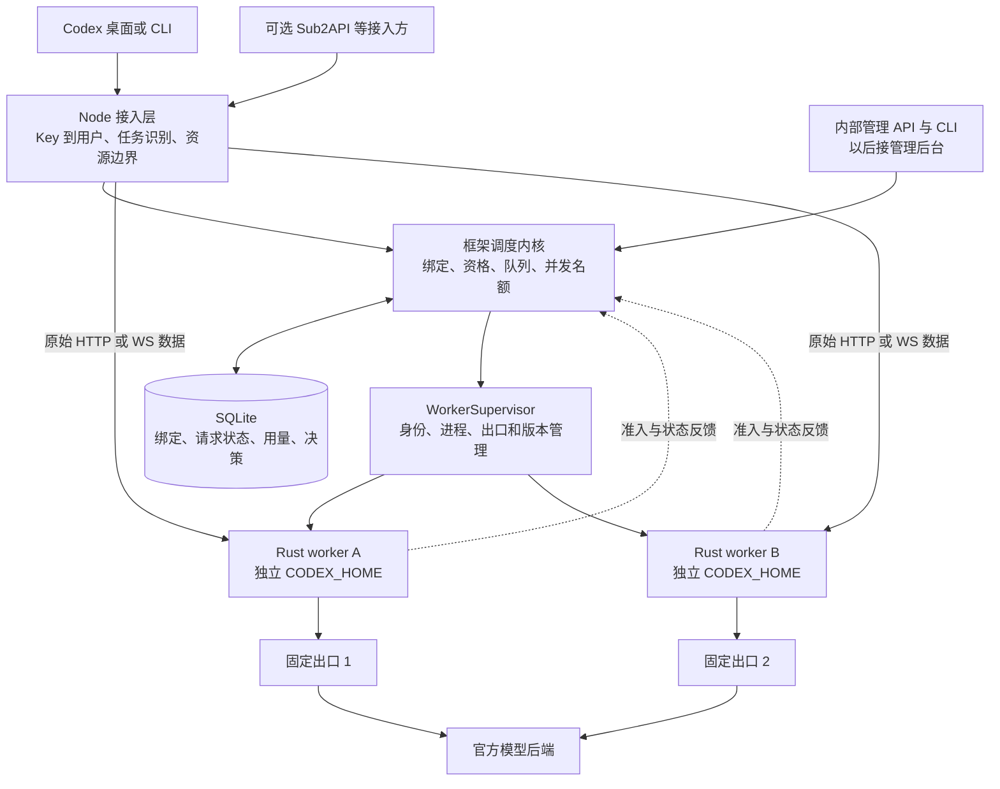
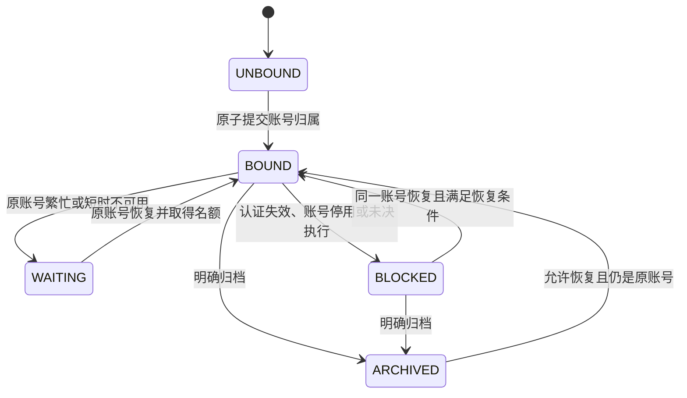
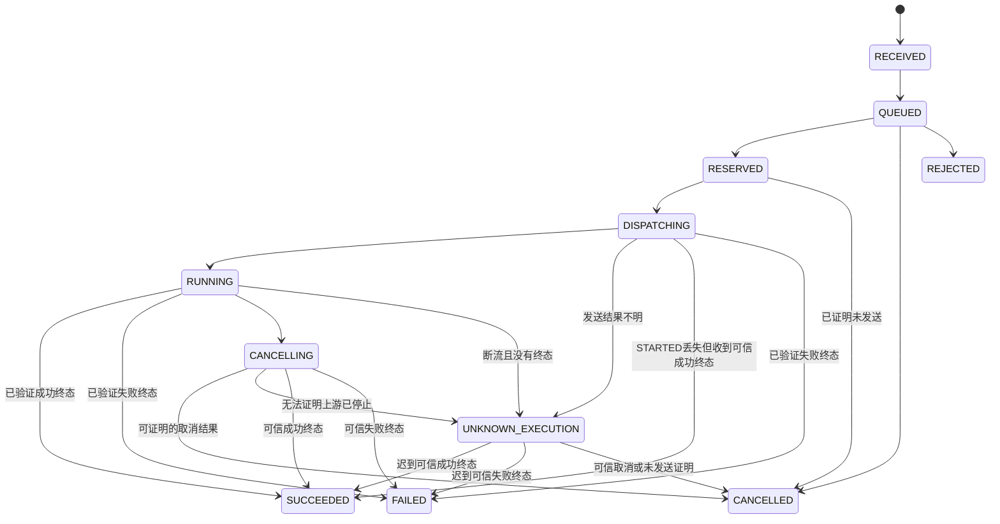

# 内置多账号调度设计 v1

初稿：2026-09-17；原型后修订：2026-09-18。状态：设计稿，生产调度尚未实现；本文中的接口、配置、状态和命令均为拟议合同。独立原型测试通过不代表正式 Node/Rust 调度器已经验收。

本设计以用户已经确定的目标为准：框架独立提供完整调度能力；多个用户共享账号池；每个任务稳定绑定一个账号；忙时有序等待；失败时行为明确；能够解释每次调度。Sub2API 等系统仅是可选客户端，管理后台可以后做。

2026-09-18 用户已选定沿用现有 native runtime，保留本机 Agent/工具及服务器集中认证。后续设计不再以改成完整官方 app-server 为前提。减少额外风险的具体约束是：任务和账号身份稳定、出口固定、并发有界、未知执行不重放、请求不改写、变化可追踪；不据此推导账号风控概率。

详细实现合同见 [调度状态与控制合同](scheduler-control-contract.md)，出站验收见 [出站一致性合同](scheduler-fidelity-contract.md)。三份文档共同定义这一版，存在冲突时必须先修正文档，不能由实现者自行选择较宽松规则。

新会话按[实施清单与交接](scheduler-implementation-plan.md)推进M0–M3；清单记录进度与验收，不另建一套技术规则。

### 原型已经回答的问题

原型源码及完整证据在[独立验证报告](../../codex-bridge-scheduler-validation/validation/REPORT.md)，不作为本仓库的运行依赖。

| 已得到的证据 | 本次设计决定 | 尚未证明 |
| --- | --- | --- |
| 固定版本官方 core 的 8 阶段身份测试：thread-id 跨续聊、压缩、重连、重启保持；fork 握手有父来源 | 原生适配使用 thread-id；已知父任务的 fork 继承账号 | 桌面全生命周期、Windows、自动子代理及未来版本 |
| 未压缩 root 的 fresh/resume 握手可能完全相同 | 未登记 root 不自动视作 fresh；多账号入口需要来源登记 | 仅改 provider URL 即可透明接入任意新旧任务 |
| 12 类错误观测：客户端会重试及 WS→HTTP 回退 | 两种传输共用绑定、任务障碍和准入；不依赖错误码阻止重试 | 已成功交付后的迟到重试端到端去重 |
| SQLite 原型 19 项测试及真实 core 接入准入通过 | 固定绑定、原子计数、重启保护可以沿此方向实现 | 正式 Rust worker、生产负载、真实取消确认 |
| 本地 interrupt 不是远端终止证明 | 分离生成、交付和资源状态；独立观察终态，未知保留占用 | 定时自动恢复同时保证真实上游绝不重叠 |

## 1. 关键决策

| 决策 | v1 方案 |
| --- | --- |
| 调度归属 | 框架自己的调度内核；无 Sub2API、CPA、外部管理后台依赖 |
| 默认绑定策略 | `strict_task`：任务绑定提交后不自动更换账号 |
| 绑定粒度 | 稳定用户身份 + 接入命名空间 + 任务 ID；用户可同时拥有多个独立任务 |
| 绑定持久性 | SQLite 持久保存；空闲、连接关闭、额度耗尽、网关重启都不删除账号归属 |
| 初始部署形态 | 单机、单调度协调器、多账号独立 Rust worker；不引入 Redis、消息队列或 Kubernetes |
| 账号认证 | 每个真实上游身份只有一个活动认证维护者；调度器不复制、刷新 OAuth 凭据 |
| 并发计数 | 用户、账号、全局的活跃请求名额，另设 WS 连接数限制；一个任务默认最多一个活跃生成 |
| 排队 | 有上限、可取消、按用户公平轮转；同一任务内 FIFO，其他账号的可执行任务不被坏账号阻塞 |
| 失败切换 | 不自动切号；已发送但完成情况不明时，不自动重放 |
| 协议处理 | 原始正文与应用消息用于转发，只读副本用于识别身份、模型、状态与用量 |
| 出站验收 | 调度不能新增正文/应用消息差异；官方直连对照按固定版本、采样完整性和逐项差异合同验收 |
| 取消默认策略 | 已发送操作进入有界终态观察；观察超时只回收本地观察资源，不自动消除未知占用 |
| 管理方式 | 内部管理 API + CLI 先行；将来后台调用同一服务层 |
| 可选外部接入 | 外部系统调用本框架统一入口；不得绕过准入直接调用 pooled worker |

“完整调度”在这里指独立完成鉴权、资格判断、任务绑定、容量准入、排队、故障反馈、恢复、归账、维护和审计。它不等于承诺上游永远可用、任意断点无损恢复，或一个任务可以自动使用所有账号的额度。

## 2. 不可破坏的约束

1. **绑定不漂移**：一旦任务的 `account_id` 提交，限流、繁忙、冷却、出口故障、重启、模型变化均不得触发自动换号。
2. **先落绑定，再发请求**：任何业务模型操作及其上游 WS 握手，都必须能追溯到已提交的任务归属和相应准入记录；认证/额度等账号管理通信另行限频审计，不能作为生成旁路。
3. **先拿名额，再发送生成消息**：WS 建立连接不等于取得生成名额。名额分配必须是原子的，不采用先读计数再加一。
4. **任务隔离**：响应 ID、父任务、上下文来源只在有权限的 principal 内解析，不能因共享账号而共享会话访问权。
5. **身份不偷换**：同一个 `account_id` 不得在后台替换成另一真实 OAuth 身份；同一真实身份不能注册两份来增加名额。
6. **上游语义不改写**：不静默换模型、reasoning、tools、上下文；不删除 `previous_response_id` 以掩盖续接失败。
7. **失败可见**：HTTP 200、WS 101、进程存活都不等于生成成功；未见完成证据不能合成成功。
8. **没有隐形重放**：结果不明不重试；同一任务不能借更换请求 ID 绕过未决执行保护。
9. **租约超时不是完成证据**：心跳过期只说明失联，不证明上游计算已停止。
10. **调度可解释**：每次选择、等待、拒绝、释放、恢复都有稳定原因码及关联 ID。

## 3. 组件与部署



### 3.1 Node 层

- `IngressAuth`：用户 Key、稳定 principal、权限、接入来源。
- `TaskIdentityResolver`：规范化客户端任务标识，核对冲突和响应归属。
- `Scheduler`：账号资格、持久绑定、队列和租约；只此处拥有调度决策权。
- `WorkerSupervisor`：复用 `NativeRuntime` 启动与监视能力，每账号一个实例；为每个 worker 提供独立代理环境。
- `StateStore`：事务存储接口，v1 由 SQLite 实现。
- `ManagementService`：供 CLI 和未来后台共同使用，不允许绕过业务层直接写数据库。

当前单账号 native 配置可转换成“一个用户、一个池、一个账号”的兼容配置，仍走调度内核。`legacy` 不参与账号池设计。新的共享入口使用用户 Key，worker capability 只供内部使用。

### 3.2 Rust worker

继续负责官方认证、固定上游、HTTP/SSE/WS 通信和代理出口。增加受控的只读协议观察及调度控制通道，不加入 Agent、提示词重组或客户端工具执行。

WS 在 Rust relay 已经解帧的位置提取最少元数据；转发仍使用收到的原始应用消息。Node 的 WS 数据通道继续保持透明隧道，不再建第二套帧解析器。

调度控制通道独立于模型数据通道，使用回环地址和每个 worker 独立 capability；所有控制消息携带 `worker_id`、`worker_generation`、`scheduler_epoch`、请求 ID 和递增事件序号。外部请求中的同名内部头必须剥离。worker 只能为已分配给自己的账号和连接申请名额。

### 3.3 存储与运行边界

SQLite 使用本机持久卷、WAL、外键、短事务和持久提交；不放在网络共享盘。数据库记录及文件权限限制到服务用户，OAuth token、API Key 明文、提示词和模型正文不入库。

Node 20 下的 SQLite 与 zstd 支持需要显式依赖；驱动/编解码版本在实现时锁定并验证部署平台，不假定已有内置 API，也不维持“零依赖”作为架构硬约束。

v1 明确只支持一个活动协调器；使用进程生命周期持有的本机独占锁阻止第二实例启动，不能靠一个会过期的锁文件时间戳。扩容为多协调器时需另行设计共享存储和分布式 fencing，不以共享 SQLite 文件冒充高可用。

## 4. 任务身份：先解决“这到底是不是同一任务”

### 4.1 三种身份分开

| 身份 | 含义 | 不应替代它的值 |
| --- | --- | --- |
| `principal_id` | 稳定用户/租户身份；多个 Key 可属于同一用户 | API Key 字符串、客户端 IP |
| `task_key` | 一个逻辑任务及其模型续接链 | 用户 ID、项目目录、请求正文哈希 |
| `request_id` | 一次推理、压缩或图片操作 | session ID、父任务 ID |

内部任务键为 `(principal_id, ingress_namespace, external_task_id)`。Key 轮换不改变 principal；同一接入方式的 namespace 不随机器重启、端口或 Key 变化。任务 ID 相同但 principal 不同，是不同任务，不能共享绑定。

### 4.2 身份来源与冲突处理

1. 框架契约头 `x-bridge-task-id`：适用于能显式传入任务 ID 的客户端或可信适配器。
2. 原生 Codex 适配器：把经过版本合同验证的 `thread-id` 等字段映射到任务 ID。`session-id` 只有经验证确实代表任务时才可使用。
3. 已登记的 `previous_response_id` 可恢复既有任务归属；必须先验证 principal。它不能解决所有首请求和 WS 握手。
4. 如果同时存在任务 ID、前序响应、父任务或已知上下文来源，必须互相一致。不能简单按字段优先级覆盖冲突。
5. 本次原生样本的 `x-client-request-id` 等于 thread-id，不能用作逐操作幂等键；`prompt_cache_key`、提示词哈希和 IP 也不是绑定依据。

任务标识只回答“是哪项任务”，不回答“是否继承旧上下文”。严格池来源登记包含：`fresh` 显式声明空白新任务，`fork` 指向已核验父任务，`resume` 指向已登记任务，`import` 由管理端核实原账号。HTTP 与 WS 使用同一来源要求；HTTP 正文检查可以核对声明，不能因为缺少 previous_response_id 就自动认定 fresh。WS 在上游握手前完成登记和绑定，首帧再核验。固定账号入口可按其受限合同登记 fixed_account_unverified，不能仅凭数据库中未出现的 thread ID 就宣称空白任务。

没有可验证任务身份时，所有调度入口都返回 `400 task_identity_required`，不随机选号、不偷偷退化为用户粘连。固定账号兼容入口同样要求稳定任务身份，以落实任务级执行/交付保护；只有来源接入方式不同，并明确不提供多账号任务分配。

原型已经验证固定版本 core 的 thread-id 生命周期与 fork 来源；未登记 root 的 fresh/resume 仍不可区分。第一版明确两种接入：能显式登记的客户端/可信生命周期适配器使用严格账号池；仅改 URL、不能登记的原生客户端先使用明确账号的兼容入口，同样经过鉴权、计数、排队、持久绑定和故障保护。固定入口只能限定账号候选，不能给未知旧上下文或跨用户引用背书。提供登记 API 不等于已经交付桌面适配器；严格池的零操作接入不能提前标记完成。

登记是鉴权后的声明与校验合同，不是无条件信任客户端历史。fresh 声明后发现前序响应、assistant/tool 历史或已知不透明旧上下文时，在发送前拒绝；未知协议语义不能靠删除字段通过。注册与数据面时序、导入边界见控制合同第 2 节。

### 4.3 续接、分支与压缩

- 已绑定任务：客户端重连、完整历史重发、V2 压缩、普通工具续接都保留账号归属。
- 新任务引用自己已有的响应或父任务：作为有来源的分支，继承父账号；并发仍独立计数。
- 客户端 fork 换了 thread ID，不代表上下文与账号无关。对已知加密推理、compaction 产物和不透明 turn state，可记录带服务端密钥的摘要索引，辅助验证来源；不保存原文。
- 新任务带历史 assistant/tool 结果或加密上下文而无法确定来源：返回 `409 context_origin_required`，要求显式父任务或受控导入，不能当作全新空白任务分配。
- 未知未来字段原样保留；框架不声称能识别所有未来的状态依赖。未通过合同验证的客户端协议版本不能自动获得跨任务导入能力。
- 引用其他 principal 的响应或上下文：返回统一的不可用/无权限错误，避免泄露对方任务是否存在。
- `previous_response_id` 未登记时，不尝试遍历账号找它；返回 `409 continuation_owner_unknown`。历史任务迁移需要管理员指定已核实的原账号。

响应 ID 及必要上下文归属应在对应响应事件交给客户端前持久登记；提交失败则结束该请求并报告不确定性，不继续发出一个重启后无法追踪归属的成功结果。

## 5. 绑定生命周期



状态与账号归属分离：`WAITING/BLOCKED/ARCHIVED` 都保留原 `account_id`。HTTP 响应结束和工具等待不等于任务结束。

没有“空闲 30 分钟后删绑定重新轮询”的规则。内存缓存可以过期，持久绑定不能随缓存过期。需要清理历史时保留任务 ID → 原账号的归属墓碑；若按数据删除要求连墓碑也删除，则旧命名空间关闭、旧任务恢复被拒绝，客户端必须显式使用新任务 ID。

v1 不提供修改既有任务 `account_id` 的普通管理接口。原账号长期不可用时，用户可显式创建新任务；使用原上下文跨账号导入属于独立功能，第一版不承诺。重置或删除绑定不能作为自动故障恢复手段。

## 6. 一次请求如何调度

### 6.1 资格过滤优先于选号

先检查用户授权、账号真实身份、所需模型/路由能力、管理员开关、认证状态、已知额度耗尽、出口可用性和维护状态。不能用更高的分数覆盖任何硬性不合格条件。

账号信息分开存储，不压成一个含义混乱的 `healthy`：

- 管理状态：`enabled / drain_new_tasks / maintenance / disabled`。
- 认证状态：`valid / refreshing / invalid / unknown`。
- 运行状态：`ready / starting / unreachable / stopped`。
- 额度：各窗口观测值、重置点、来源、观测时间及新鲜度；未知不写成 0% 或 100%。
- 模型状态：能力目录与特定模型冷却。
- 出口状态：`egress_id`、固定绑定、最近失败与恢复证据。
- 容量：正在执行、等待、未决债务和名额上限。

已绑定任务只检查原账号，不进入其他账号候选集。暂时繁忙进入原账号等待队列；认证失效、长期耗尽或停用立即明确返回，不让用户无期限挂着。

### 6.2 新任务选号

在合格候选中选择：

1. 优先拥有立即可用名额的候选。
2. 比较标准化负载 `(active + uncertainty_debt + eligible_waiting) / configured_capacity`。
3. 接近时按权重轮转，使用稳定的游标和 account ID 打破平局。

第一版不使用复杂预测评分，也不根据单次失败推断“账号质量”。额度数据新鲜且明确耗尽时排除；未知额度默认允许以保守上限运行并标记 `quota_unknown`，通过真实反馈校正，不伪造精确剩余请求数。

HTTP 新任务在等待期间可保持 UNBOUND；首次取得容量时在同一事务中提交绑定、请求状态、各层名额及决策记录。两个并发首请求通过任务唯一约束和事务复查收敛到同一账号。事务提交后即使尚未发出请求，也不自动换号。

### 6.3 正常执行顺序

```text
鉴权与请求大小保护
  → 只读提取任务/模型/前序响应
  → 校验身份和上下文归属
  → 查询绑定，或为新任务计算候选
  → 有界等待、原子准入、提交绑定及租约
  → worker 确认租约和代际
  → 记录 DISPATCHING 后才允许向上游发送
  → 原样转发，观察响应/错误/用量
  → 记录已证实终态、释放名额、唤醒等待者
```

账号选取与取得名额可能因取消、配置变化而需要重新检查，但只能在尚未提交绑定时重新选择；绑定提交后只能等待原账号。

## 7. 公平队列与容量

### 7.1 名额的定义

| 资源 | 取得时机 | 正常释放时机 |
| --- | --- | --- |
| 用户活跃名额 | 准备发送一次模型操作 | 可信操作终态持久提交后释放，与下游排空分开 |
| 账号活跃名额 | 同上 | 同上 |
| 全局活跃名额 | 同上 | 同上 |
| 任务执行名额 | 同上，默认 1 | 同上；绑定仍保留 |
| WS 连接名额 | 握手前 | 连接完全关闭 |
| 下游交付/缓冲预算 | 接受连接或缓冲数据前 | 对应连接关闭、缓冲排空或丢弃；不释放未知生成占用 |
| 取消后的观察资源 | 已发送操作失去下游且仍可读取上游 | 终态提交或观察期限/字节预算耗尽；后者保留 UNKNOWN |
| 排队名额和正文内存 | 请求进入等待 | 派发、取消、超时或连接关闭 |

一次模型返回工具调用并结束后释放生成名额，客户端执行工具期间不占该名额。下一次携带工具结果的请求重新排队，但继续使用原账号。独立子任务可有独立任务名额；有父上下文依赖的子任务继承账号，仍受用户和账号总上限约束。

`/models`、健康检查使用单独的低成本管理请求限制；不占生成名额。`/responses`、compact、图片操作都纳入执行容量，图片可增加独立子限额，不能成为绕过账号总上限的通道。所有 response.create（包括 generate:false 预热）均经过任务、来源和执行准入；不能复用原型中预热绕过准入的测试适配。预热终态与资源回收需专门验收，未确认前不能凭字段名授予旁路。

### 7.2 队列算法

用户之间采用等权轮转；管理员可配置用户权重。每次轮到某用户，从该用户最早的“目前有资格且有容量”的任务头部取一个请求。同一任务内部严格按接收序排列，不允许后一个请求越过前一个。

账号 A 满载时，绑定 A 的请求继续等待；绑定 B 的其他任务仍可执行。新请求不得越过同一可执行队列中已等待的请求直接占槽。权重控制获得开始机会的频率，不声称保证 token、算力或完成时间完全公平；长请求不被抢占。

不能在等待账号名额时先长期持有用户/全局名额，避免占槽等待导致其他任务饥饿。所有生成名额一起取得或一起不取得。

### 7.3 初始参数建议

这些值用于第一版合同和压测起点，不代表当前账号已经验收的容量。

| 参数 | 初始建议 |
| --- | --- |
| 单账号活跃上限 | 默认 1，管理员按实测调整 |
| 单用户活跃上限 | 默认 2，同时受账号和全局上限约束 |
| 单任务活跃上限 | 1 |
| HTTP / WS turn 最大等待 | 15 秒，与客户端期限取更小值 |
| 每任务等待数 | 原生无逐操作键最多 1 项待执行/执行操作；显式不同操作键最多 4 项等待 |
| 每用户等待数 | 16 |
| 全局等待数 | 128，另受字节预算限制 |
| 全局排队正文预算 | 初始 128 MiB；上传、解码副本和待发送 WS 消息另计总内存预算 |
| 单用户 WS 连接数 | 默认 8；账号和全局另设上限 |

排队只服务仍连接着的同步客户端。取消或断连立即撤销未派发请求；不持久保存正文以便后台自动重跑。重启后旧排队元数据记为中断，用户需重新提交。

## 8. HTTP、SSE 与 WebSocket 合同

### 8.1 HTTP / SSE

保留请求原始 Buffer，检查其大小；用有界只读解码器提取少量路由元数据。原始字节用于发送，绝不对解析结果执行 stringify 后转发。

- 保留现有 16 MiB 线缆正文上限；增加解压后大小、展开过程、解析时间及并行解码预算。
- 建议解压副本上限初始 64 MiB，需通过真实长上下文合同调整；达到上限明确 413，不能截断后继续。
- 支持的 encoding 必须明确并测试，包括实际客户端使用的 zstd。不认识的编码在派发前返回 415，不能绕过模型/归属校验偷偷放行。
- 关键路由字段重复、冲突或类型不合法，派发前拒绝；其他未知字段保持原样。
- 排队期间不发送 HTTP 200、不添加 SSE 心跳注释，不提前决定上游 Content-Encoding；否则将无法准确返回后续 429/503，也可能破坏压缩响应。
- 收到上游状态后立即按合同转发；HTTP 状态、错误正文、Retry-After 保留。已开始流式响应后发生本地故障，结束流并记录原因，不追加第二个 JSON 响应。
- 上游由独立只读 observer 消费，再通过有界交付缓冲转发原始字节；能处理跨 chunk 事件、压缩响应及终态。慢下游可触发有界背压，但不得无限阻止终态核对：交付期限/预算超限时明确结束下游，切换有界观察，不能无限缓存或丢掉部分输出后宣称交付成功。观察异常不合成 completed。

### 8.2 WS 握手与模型选择

现有 Node 是字节隧道，Rust 在握手阶段连接上游；因此第一版要求 WS 升级前具备稳定任务身份。不能先返回 101，再根据首帧临时换账号，同时声称完整保留上游握手语义。

已绑定任务使用原账号。严格池的新 WS 任务先核验来源登记；没有来源登记在 101 前返回 `409 task_origin_required`，不建立永久绑定。固定账号入口可按已授权路由建立 fixed_account_unverified 记录并绑定唯一账号，不作 fresh 推断，仍拒绝身份缺失和已知来源冲突。分支任务直接继承父账号。已明确为空白的新任务可能在握手时还没有 model，因此 v1 使用池的 `ws_model_contract`：候选账号必须都支持这一声明模型集合，即使用候选能力的交集，不能用并集冒充每个账号都支持。没有合格候选则握手前失败。

握手前同样核查未知执行、交付未确认和管理暂停等任务障碍；已有账号绑定不意味着可以无限重连上游。允许建立连接也不代表取得任何逐轮生成许可。

新 WS 握手原子取得连接名额并持久绑定账号；即使首个生成尚未发生，绑定也不自动改变。首帧和后续每个 `response.create` 再检查实际模型、权限和任务归属。请求模型不在合同或原账号能力内时，明确报错，不临时选另一个账号。

有父上下文的 WS 分支必须在握手前已登记父任务，或通过经过验证的适配器提供父任务身份。首帧仍要复核来源：若调用方声明 fresh 却传来前序响应/加密历史，必须在发送该帧前拒绝，不能改绑或把帧先发出去试错。来源不明的新任务不会先随机绑定。若原生客户端无法在握手前提供来源，该类新 WS 任务需登记适配，属于明确的 v1 兼容限制，不能宣称开箱即用；M0 必须确认这一点，并据此决定是否另做终止下游 WS 的适配模式。

异质能力池可以先支持 HTTP；要为异质 WS 池按首帧选账号，需另行设计由框架终止下游握手的适配模式，不能混进透明模式。

### 8.3 WS 每轮准入

1. Node 在握手前鉴权、解析任务、选择并固定 worker，取得连接名额。
2. Rust 收到完整 `response.create`，只读解析必要字段，向内置 Scheduler 申请执行名额；原始消息在有界内存中等待。
3. Scheduler 校验已绑定账号、用户权限、前序响应、模型和容量；permit 带请求 ID、代际及一次性使用标识。
4. Rust 确认 permit 后才发送原始消息；同一 permit 不得用来发送两个操作。
5. Rust 观察上游事件，按序登记响应归属、终态和用量；调度器幂等记账并释放名额。
6. 连接关闭撤销未派发等待；正在执行的请求进入取消/终态核对流程。

每次 turn 准入都重新检查 Key 是否撤销、principal 权限和账号配置版本；长期打开的连接不保留永久授权。撤销后拒绝新 turn，在途操作按撤销策略明确处理并记录，不自动切换用户或账号。

等待名额不能阻塞读取关闭、断连和必要控制帧；实现时将控制处理与有界的待发送数据队列分开，生成消息保持原顺序。未知应用消息不擅自当成完成、取消或新生成；未知协议版本须通过能力合同，不能让可触发生成的未识别消息绕过准入。

本地 WS 准入错误采用经过当前 Codex 客户端测试的 `error` 事件，带框架命名空间错误码和请求关联信息；不得伪造官方 `response.completed`。若协议无法可靠关联某个错误，关闭连接并给出稳定关闭原因，绑定仍保留。上游事件原样传递，本地产生的错误必须能识别来源。

固定版本实测表明，409、WS 关闭或 retryable:false 都不能可靠禁止客户端重试。HTTP 回退必须进入同一 Scheduler，不能重新分配账号、清除来源要求或未决障碍。错误事件负责说明，持久状态负责拒绝；同任务等待中只允许一个无逐操作 ID 的原生生成，后到请求不能排成若干次相同生成。详细行为见控制合同第 3 节。

v1 一个任务最多一个活跃生成。若客户端引入单连接多 stream 并发，需要显式增加按 stream 计数和隔离的合同；不能默认按“一连接最多一个生成”接受未知多路协议。

### 8.4 观测失败的处理

路由必须的元数据在派发前无法解析：拒绝请求。已开始流后，终态/响应归属无法可靠观察：结束受影响操作、记录 `protocol_observation_failed`，保留未决执行保护。仅用量字段缺失时可以记录 `usage_unknown`，不能因统计不全改写已确认的业务结果。

终态按路由和协议版本定义：Responses 核对关联的 completed/failed/incomplete；一般 `error` 事件不能未经确认就释放任意活跃请求。图片和非流式 compact 依据完整的 HTTP 响应及该路由的成功/失败合同判断。没有成功终态就不能把 EOF 或 HTTP 200 单独当作成功；明确的上游拒绝则可以记录为失败并正常释放。

## 9. 请求、租约与故障恢复

### 9.1 请求状态



`RESERVED` 表示名额已分配但尚未进入发送边界；`DISPATCHING` 必须在网络发送前持久写入。这个保守顺序允许误判“其实没发出去”为未决，但避免把“已经发出”误认为安全重试。

一个逻辑 request 可包含现有官方 401 恢复所需的多个受限 attempt。每次真实上游发送有独立 attempt ID 和发送记录，同一个 request 的执行 lease 覆盖整个恢复过程；中间 401 只结束当前 attempt，不结束 request、不释放容量。恢复后的新 attempt 使用受控的新发送许可，不能把同一 permit 重复消费。恢复耗尽后的最终拒绝可以正常结束；恢复中途发送结果不明则进入 UNKNOWN_EXECUTION。普通 429/5xx 不获得这项例外。

完成结果和下游交付情况分开记录。例如已经收到并持久提交 completed，但客户端连接随后断开，执行可以是 SUCCEEDED，而 `delivery_status=interrupted`。不能为了让客户端收到答案再次生成。

### 9.2 各类失败的明确行为

| 情况 | 行为 | 自动换号 / 自动重放 |
| --- | --- | --- |
| 原账号忙 | 在原账号队列有界等待，超时返回 `429 account_busy` | 否 / 否 |
| 用户或全局满载 | 公平队列等待，超时分别说明限制来源 | 否 / 否 |
| 原账号已知额度耗尽 | 返回限额错误及可信重置时间；保留绑定 | 否 / 否 |
| 认证过期 | worker 采用现有官方有界 401 恢复；并发恢复合并为同一账号单一进行中的刷新 | 否 / 仅现有明确 401 恢复边界 |
| 认证撤销或刷新失败 | 账号 auth invalid，已有任务 BLOCKED；通知管理者 | 否 / 否 |
| worker 尚未发送就不可达 | 503，允许同账号重试；可重启同身份 worker | 否 / v1 不代客户端重放 |
| 429 / 明确过载 | 保留上游错误，按作用域进入冷却，后续请求继续找原账号 | 否 / v1 不自动重放 |
| HTTP 200 中出现 error / response.failed | 按失败登记，原样转发事件 | 否 / 否 |
| 已发请求后断流、worker 崩溃 | `UNKNOWN_EXECUTION`；保留原账号及未决容量 | 否 / 否 |
| WS 原响应状态丢失 | 同账号重连；不能恢复则返回续接错误，等待客户端合法恢复 | 否 / 不删 previous_response_id 重试 |
| 客户端取消 | 未发送且许可已可靠撤销则取消；已发送停止交付，进入有界上游终态观察，观察失败转 UNKNOWN | 否 / 否 |
| 数据库写失败 | 停止新准入；受影响在途按已掌握证据收尾 | 否 / 否 |

错误优先按明确原因分类，不能把所有 403 判为账号永久失效、所有 429 判为周额度耗尽、所有 5xx 判为出口故障。冷却按账号/模型/出口分层，恢复时由一个受限探测者检查，不能让所有排队请求同时冲击恢复中的账号。

### 9.3 未决执行与可用性的边界

本地连接关闭、进程被杀或租约 TTL 到期，都不能严格证明上游计算已经停止。因此分别记录本地资源释放和 `uncertainty_debt`：本地 socket 可以清理，但未决占用仍扣减账号/用户/全局可用额度，并阻止同一任务自动继续。

可通过已观察的上游终态、可信的上游状态核对，或管理员显式接受不确定性来解除。不得设置一个任意 30 秒定时器就宣称安全释放。人工解除必须记录操作人、依据和风险接受，不改变任务账号归属。

普通取消也可能进入此状态，不仅是极端故障。在没有上游查询/取消确认能力时，无法同时承诺“物理上游并发绝不超限”和“未知请求总能自动在固定时间内恢复”。正常完成路径自动释放；未知占用保持并触发有去重的告警。原账号容量被耗尽时暂停新绑定、明确拒绝受阻任务，其他有容量账号继续服务。

默认不按时间自动接受未知风险。人工释放另记 lease=WAIVED_UNCERTAINTY、业务结果仍 UNKNOWN，保留潜在重叠风险账目；不能改写成 cancelled/completed。迟到终态只结算原操作，不再次减槽。下游交付明确中断但上游已完成时，生成容量可释放，任务保留 delivery_unconfirmed 障碍；可信续接核验或显式管理恢复前不重新生成。完整转换与恢复入口见控制合同。

### 9.4 调度器重启与 fencing

1. 取得单实例锁，打开数据库，增加 `scheduler_epoch`，先进入恢复模式，尚不接收新生成。
2. 保留任务绑定；旧 QUEUED 记为连接中断，正文不会从磁盘恢复或重跑。
3. 对旧 RESERVED/DISPATCHING/RUNNING 逐一核对 worker 代际和执行记录；只有确认未发送的 RESERVED 可安全撤销。
4. 失联 worker 被 supervisor 终止或隔离，恢复同身份 worker 前核对认证目录独占锁。旧 worker 不得接受新 epoch 的请求，也不得使用旧 permit 发送新的请求。
5. 无法确认终态的操作进入 UNKNOWN_EXECUTION；其余账号恢复服务，不能把全部旧计数直接清零。

epoch 同时包含持久计数和随机启动 ID，避免备份回滚后重复使用同一派发身份。worker 控制通道失效立即冻结新的发送；恢复握手建立显式派发屏障，撤销尚未消费的旧 permit，并上报全部活跃执行及未 ACK 终态。只有发送日志中从未签发最终发送授权的保留项，或 worker 原子撤销并确认从未发送的项，才可据证据回收；旧进程退出仅能阻止它以后发送，不能证明已经授权的 attempt 过去未发送。拿不到证明的旧授权保留为未决，不能仅因 RESERVED 标签或超时而释放。

fencing 保护框架不再派出新请求，不能撤销已发送给外部上游的请求。事件去重使用 `(worker_id, generation, event_seq)` 和请求状态，重复 release 不得减成负数。

worker 对已接纳的 `attempt_id` 去重；重复派发只能查询/返回已有状态，不能再次发送上游。worker 保留未获调度器持久化确认的终态记录，在重连对账时重送；如果 worker 本身崩溃且证据未持久保存，则仍按未知处理，不能靠“活跃列表里没有它”释放。旧代际的终态只可在对账通道核验并结束其原有 lease，不能释放新代际的新 lease；旧代际的新派发请求一律拒绝。

控制事件的确认顺序为：worker 上报响应归属/终态 → Node 提交对应事务 → Node ACK → worker 才可遗忘未确认记录。成功终态事件交给客户端也必须在相应提交之后。统计字段缺失不阻塞已经确认的终态；身份/终态提交失败不能被统计层吞掉。双方同时崩溃且没有可恢复证据时，接受进入 UNKNOWN 的保守结果。

降低并发上限只阻止新准入，允许已有执行自然排空；已有占用可能暂时高于新上限，不强杀后伪造释放。容量权威以持有/隔离中的 lease 记录为准，内存计数仅为缓存。

旧数据库备份恢复属于数据回滚，不能按普通重启自动开放流量。应进入恢复模式，核对备份时间之后的绑定/执行记录；无法补全时关闭旧接入命名空间的自动新建与恢复，旧任务明确失败，新任务必须进入显式建立的新命名空间。禁止把恢复后找不到的旧任务当作全新任务重新选号。备份使用 SQLite 一致性备份方式，并演练数据库、凭据引用与账号身份的对应恢复；不能直接复制运行中的单个数据库文件后声称备份完整。

### 9.5 幂等边界

为支持显式请求标识的调用方提供 `(principal, task, idempotency_key)` 索引，同时校验原始请求摘要。相同 key 不同内容返回 409；相同操作仍在等待/运行时返回其状态，不创建第二个上游请求；已完成时返回已完成状态，不重新生成、不从不存在的缓存重建 SSE。

不承诺把相同正文视为同一次请求：用户可能确实重复提问。原生客户端的请求 ID 只有经验证跨重试稳定后才能用于幂等。默认不持久化模型结果，因此不提供完整响应重放。

幂等保留期限和任务绑定保留期限分开；超过幂等记录期限不能声称仍能去重。客户端、可选代理和官方 SDK 自身的重试也需验收；框架的“不重放”不等于端到端 exactly-once。

原生 profile 缺少可信逐操作幂等键时，任务从首请求排队起即设串行障碍，QUEUED/RESERVED/DISPATCHING/RUNNING/CANCELLING/UNKNOWN 期间的其他生成入口不创建第二份排队操作。明确完成且交付中断转 delivery_unconfirmed。成功交付后再到的旧请求与用户主动重复提问可能不可区分，不用正文哈希伪造保证；需要端到端幂等的调用方必须提供经过验证的逐操作键。可信工具续接发生在上一操作释放且交付障碍已解除之后。

## 10. 状态模型与事务

| 实体 | 核心字段 |
| --- | --- |
| `principals` / `api_keys` | 稳定用户 ID、Key 校验摘要、授权池/模型、限额、启停；Key 轮换保持用户 ID |
| `accounts` | 不可复用的 account ID、上游身份指纹、workspace 身份、配置版本、并发、管理状态 |
| `workers` | account ID、generation、固定出口引用、运行状态、协议能力版本 |
| `egresses` | 出口 ID、凭据引用、健康状态；不存代理明文密码 |
| `pools` / `pool_members` | 账号授权集合、权重、WS 模型合同 |
| `tasks` / `task_aliases` | principal、namespace、任务 ID、account ID、父任务、状态、绑定时间和墓碑 |
| `response_owners` / `context_origins` | principal、响应 ID 或带密钥摘要、task/account、来源、可用期限 |
| `requests` / `attempts` | 请求 ID、幂等摘要、任务、模型、状态、CAS版本、发送边界、交付状态、截止时间 |
| `leases` | 请求、各层资源、epoch/generation、取得/释放证据、未决债务、人工风险接受记录 |
| `control_events` / `task_guards` | worker事件序号/摘要/ACK结果、任务级执行/交付障碍、原请求引用 |
| `observations` | 额度/认证/模型/出口观测、来源、采样时间、新鲜度 |
| `usage_ledger` | 请求/attempt、输入/输出/缓存用量、requested/reported model、确认或未知状态 |
| `decision_events` | 关联 ID、候选摘要、选择/拒绝原因、配置版本、排队耗时 |

关键约束：任务键唯一；真实认证身份活动注册唯一；一次请求的活跃 lease 唯一；响应归属不可跨 principal 覆盖；账本按 attempt 和终态版本去重。

核心事务：

- 新任务绑定 + 准入 + 请求 RESERVED + 决策记录一起提交。
- 已绑定任务在同一事务内复查账号归属、权限/配置版本与容量，再占位。
- 终态 + 用量状态 + lease 释放 + task_guards + 审计一起提交；交付未结束时原子保留 delivery_pending，已中断则置 delivery_unconfirmed，不能先清障释放再另行补障碍。迟到重复事件只更新证据，不重复释放。
- 禁用账号、修改权限、维护排空在配置事务后由调度器更新队列；不能数据库和内存各说一套。

慢网络、模型调用、代理探测和解压不放在数据库事务中。排队唤醒以短事务重新检查资格，不能依赖过期的候选快照。

写侧事务采用 `BEGIN IMMEDIATE` 或等价的串行写入机制；内存中的“可用名额”不得代替事务内最终检查。worker 发起的 WS 准入与 HTTP 准入必须共用这一实现，不能分别维护容量计数。

## 11. 额度、模型和可解释性

额度由本框架提供，不能要求外部系统保存 OAuth 才能工作。worker 通过官方可支持的只读查询及实际响应元数据反馈额度；调度器统一限频并展示 `observed_at / stale / source`。首次自然刷新、额度查询端点和窗口语义都需要独立验收。

用量归账先提供 token 与请求层账本；货币计费和充值不是第一版调度前提。缺失 usage 记 unknown；缓存输入不重复算入总输入；失败但可能产生用量也不能记作零。请求模型与响应报告模型分开保存。当前对照报告已有模型字段不一致的样本，不能仅凭 requested model 认定实际模型或据此静默定价。

每次请求可在管理接口查询一条简明解释，例如：

```json
{
  "decision_id": "dec_example",
  "request_id": "req_example",
  "task_id": "task_example",
  "principal_id": "user_example",
  "account_id": "account_2",
  "binding": "existing_strict",
  "reason": "bound_account_busy",
  "action": "queued",
  "queue_wait_ms": 840,
  "account_active": 2,
  "account_limit": 2,
  "cross_account_failover": false,
  "config_revision": 7
}
```

最小指标：绑定命中/冲突、自动跨账号次数（应为 0）、队列等待分位数、按限制来源的拒绝数、账号活跃/未决/连接数、上游成功/失败/未知、冷却原因、额度新鲜度、首事件延迟、总耗时、协议观察失败、worker 重启和释放去重。

日志不记录 Key、OAuth、代理认证、提示词、工具参数、完整响应或不透明上下文。面向普通用户的错误不暴露账号邮箱和内部拓扑；详细候选排除原因仅管理端可见。

## 12. API、CLI 和可选接入

### 12.1 数据接口

保留 `/v1/responses` HTTP/SSE 和 WS、`/v1/responses/compact`、`/v1/images/generations`、`/v1/models`。模型列表只展示用户授权池能支持的能力；新 WS 任务使用声明的交集合同，不能把池的并集目录当作任意绑定账号的承诺。

新增框架专用 `POST /v1/bridge/tasks` 用于 fresh/fork/resume 来源登记，业务 Key 只能登记自己有权限的任务；返回稳定 task ID 与来源状态，不暴露账号凭据。相同外部任务 ID 的重复登记幂等，来源冲突返回 409；此接口不赋予调用方任意指定上游账号的权限。import 使用独立管理入口核实原账号。原生 root 不能免声明推断来源；生命周期适配器是单独待验收的交付物。

本地 HTTP 错误采用标准 `error` 外层及稳定 code；在安全扩展字段提供 `request_id`、`retryable`、`same_account_required` 和可信 retry-after。上游错误原样保留，不强行换成框架错误。

### 12.2 管理接口与 CLI

管理接口仅回环或管理网络、独立管理凭据；业务 Key 无管理权限。第一版应包含用户/Key 创建与撤销、账号注册与验证、池配置、状态查询、任务归属、队列/请求解释、排空、额度观测、未决执行审查。

拟议 CLI 示例（尚未实现）：

```text
bridge users create / keys issue / keys revoke
bridge accounts add / validate / list
bridge accounts drain --account account_2 --mode new-tasks
bridge accounts drain --account account_2 --mode maintenance
bridge tasks inspect --task task_example
bridge requests explain --request req_example
bridge requests resolve-unknown --request req_example --evidence <可信终态引用> --expected-version <版本>
bridge requests accept-uncertainty --request req_example --reason <风险接受依据> --expected-version <版本>
bridge tasks resolve-delivery --task task_example --evidence <续接或管理依据> --expected-version <版本>
bridge scheduler status
```

管理后台只调用这些已定义的服务，不拥有另一套调度状态机。支持配置导入/导出与版本化更新；示例配置只引用私有凭据文件，不嵌入真实密钥。

### 12.3 Sub2API 等外部系统接入

- 作为普通调用方连接统一入口；框架自行完成账号选择、限流、任务绑定和认证。
- 必须保留稳定任务 ID、响应链和原生协议；去掉所有任务标识的代理不符合严格池合同。
- 推荐每个实际用户一个框架业务 Key。若代理用一个共享 Key，默认整体视作一个 principal，不能据此声称完成下游用户公平和隔离。
- 若要代理代表多个用户，需独立可信身份委托合同；未经验证的 `x-user-id` 不可直接当 principal。第一版无需实现通用身份委托。
- 外部系统不得通过修改账号路由绕过本框架绑定；账号 worker 不向业务接入方开放。
- 接入方自行重试仍须遵守请求幂等和续接约束；其协议修改不归框架透明性承诺覆盖。

## 13. 出口、维护与升级

账号固定绑定 `egress_id`；HTTP、WS、登录刷新都使用该账号配置的出口。多个账号可以共享一个出口，共享出口故障时影响同组账号；不得自动回退直连或另一个出口来掩盖故障。

出口探测与账号认证探测分开。一次模型过载不能直接归因于出口；出口恢复也不能视为模型生成已恢复。网络层需要重试时，只重建到同一配置出口的连接，并遵守发送结果不明不重放的规则。

维护有两种动作：

1. `drain_new_tasks`：拒绝新任务绑定，已有任务仍可续接，不承诺何时完全空闲。
2. `maintenance`：停止新的模型操作，等待活跃执行结束；排队请求明确失败或在期限内等待。空闲 WS 可以受控关闭，绑定不删除，客户端维护后重连。

不能等“任务结束”来判断排空，因为客户端没有可靠报告逻辑任务终结；排空依据是活跃执行、未决执行和连接。超过期限后的强制关闭要标记未决结果，不能把 kill 当成成功排空。

现有独立账号网关迁入统一 supervisor 前，需逐账号停止新流量、排空并关闭旧认证维护者，使用其最新认证状态启动同一账号 worker。禁止为了并行验收复制活动 RT 给两个维护者。本文不执行任何迁移或重启。

## 14. 实现映射与阶段

建议新增 `src/scheduler/`，保持调度策略与 HTTP handler 分离：

```text
src/scheduler/
  identity.mjs         # principal、任务标识、来源冲突
  scheduler.mjs        # 准入和调度事务
  selection.mjs        # 合格候选与新任务选取
  queue.mjs            # 用户轮转、任务FIFO、有界等待
  state-store.mjs      # SQLite事务与状态恢复
  worker-supervisor.mjs
  management.mjs
  reason-codes.mjs
native-runtime/src/
  scheduler_control.rs # 私有permit和事件合同
  protocol_observer.rs # 只读元数据/终态观察
```

`src/server.mjs` 接入多用户鉴权和调度；`src/native-runtime.mjs` 支持由 supervisor 管理多个独立实例；`src/native-websocket.mjs` 继续传递原始帧并携带私有连接身份；Rust HTTP/WS 在发送边界确认 permit，终态反馈统一经过观察器。

| 阶段 | 必须交付 | 完成门槛 |
| --- | --- | --- |
| M0：身份与协议合同 | 已有 core 身份/重试证据；补来源接入、预热终态、客户端版本范围及一致性基线 | 严格池登记闭环可用；GUI/平台支持逐项标明，不把原型局部通过当完成 |
| M1：HTTP 内核 | SQLite、用户Key、账号目录、持久绑定、原子名额、公平队列、错误码、审计与CLI | HTTP/SSE的并发、重启、隔离和保真故障注入通过 |
| M2：WS 完整调度 | 连接准入、模型合同、Rust每轮permit、独立终态观察、取消与未决恢复 | 预热亦不可绕过；真实重试与HTTP回退统一保护；慢读/取消及出站对照门槛通过 |
| M3：运维闭环 | 认证/额度/出口反馈、模型冷却、排空、未决审查、旧实例迁入流程 | 没有外部管理系统仍能独立管理和恢复；受控真实验收通过 |
| M4：管理后台 | 可视化账号、用户、任务绑定、队列和审计 | 复用已有管理服务，无第二份状态和规则 |

M1 只能称“HTTP 调度阶段完成”；默认客户端使用 WS 时，M2 和 M3 之前不能称框架调度已经完整。分布式多协调器、跨账号上下文迁移、通用多供应商协议转换、精细货币账务均不阻塞这一版完成。

## 15. 验收标准

先用确定性的 fake worker 和故障注入覆盖以下合同，再进行明确标记的真实上游验收；真实验证与离线结果分开记录。

| 场景 | 必须观察到的结果 |
| --- | --- |
| 同用户两项独立任务 | 可以分配不同账号，各自后续请求固定 |
| 同任务并发首请求 | 只产生一个已提交的账号绑定，绝不向两个账号发出 |
| 新WS任务仅首帧才给父响应 | 无来源登记时在101前拒绝；伪报fresh后出现父历史则帧发送前拒绝 |
| Key 轮换 / 网关重启 / WS重连 | principal及原账号绑定不变 |
| 相同task ID、不同用户 | 绑定和前序响应访问隔离 |
| 工具循环、压缩、fork | 正确保持/继承账号，来源不明明确拒绝 |
| 绑定账号满载，另一账号空闲 | 原任务等待，不换号；其他任务可继续 |
| 一个用户大量请求 | 不能占满超过其上限的活跃槽，也不能饿死其他合格用户 |
| 账号并发N，N+1请求 | 超额请求排队或拒绝，所有路径一致 |
| WS空闲、预热、连续多轮、断连 | 连接/生成分别计算；未发送取消安全回收，已发送取消有终态才结清，无证据保留可解释债务 |
| 无操作幂等键的重复WS/HTTP请求 | 排队/在途/未知期间不形成第二项生成；不是用409/retryable:false假定客户端停止 |
| 普通取消且上游不确认终止 | 有界观察后保留未知占用并告警，不靠时间恢复；其他账号任务可执行 |
| completed提交但下游交付中断 | 释放原生成lease，保留任务交付障碍；不能自动生成补答案 |
| 人工释债与迟到终态竞争 | lease只释放一次，业务结果和风险接受可追溯，不影响新操作 |
| 调度前后及官方直连对照 | 原始正文/应用消息不变，已知差异逐项列明，未知差异或采样不完整阻断发布 |
| 排队超时/取消 | 未向上游发送；有正确原因和等待时间 |
| 进程在事务前后、发送前后崩溃 | 无跨号、无自动重放；未决请求保留保护 |
| 重复、乱序、旧epoch事件 | 不重复释放、不重复归账、旧worker不能发送新请求 |
| completed已收到但Node提交前退出 | worker重报未ACK终态；对账完成后正常释放，不重复执行 |
| 旧permit延迟到新epoch后发送 | 派发屏障使旧授权失效；没有屏障证明不提前回收 |
| 401恢复期间竞争或崩溃 | 同一逻辑请求持续占槽；中间401不释放，未决恢复不重放 |
| 429、401、5xx、HTTP200流内失败 | 分类正确；只允许明确的401恢复；错误来源可辨 |
| 压缩体、未知字段、原生工具 | 准入后发送内容与原始应用内容一致 |
| 同任务切模型且原账号不支持 | 明确拒绝，不静默换账号或降级模型 |
| 返回模型与请求模型不同 | 两者分别记录并告警，不篡改响应或静默据请求模型计费 |
| 共享出口中断 | 正确关联受影响账号；无直连/其他出口回退 |
| 数据库不可用、磁盘满、观察器失败 | 停止不安全的新准入，不丢绑定后重新选号 |
| 恢复旧备份 | 进入灾难恢复锁定；缺失任务不当新任务分配，旧未决执行不当作零占用 |
| 维护排空与账号移除 | 停新流量，原绑定保留；在途/未决状态有明确处置 |
| 不启动Sub2API/CPA/后台 | 全部调度、CLI管理和验收仍可完成 |

M0 已有固定版本 core 的两个任务、压缩、恢复、fork 和 WS 重连等原型证据；正式入口的来源登记、桌面接入、预热和完整平台矩阵仍待验收。既有采集与原型证据需写入版本化验收清单，不能把所有缺口标为已通过。

## 16. 当前基础与设计依据

已经有：每实例独立认证目录、官方HTTP/WS通信、原始正文与消息转发、401恢复、背压与断连清理、固定出口部署。未有：账号池、用户管理、持久绑定、队列、并发准入、可调度状态、用量账本和排空。

- 当前启动与转发：[`src/main.mjs`](../src/main.mjs)、[`src/server.mjs`](../src/server.mjs)、[`src/native-runtime.mjs`](../src/native-runtime.mjs)、[`src/native-websocket.mjs`](../src/native-websocket.mjs)。
- 官方认证及WS relay：[`native-runtime/src/main.rs`](../native-runtime/src/main.rs)、[`native-runtime/src/websocket.rs`](../native-runtime/src/websocket.rs)。
- 现有保真合同：[`test/native-http.test.mjs`](../test/native-http.test.mjs)、[`test/websocket-contract.test.mjs`](../test/websocket-contract.test.mjs)。
- 原型后详细合同：[状态与控制](scheduler-control-contract.md)、[出站一致性](scheduler-fidelity-contract.md)；[原型复现](../../codex-bridge-scheduler-validation/validation/README.md)。
- 当前部署记录：[`accounts-20260917.md`](accounts-20260917.md)、[`ip2-egress-20260917.md`](ip2-egress-20260917.md)。这些是快照，不替代实施前核验。
- 新增对照证据：[`chain-comparison-20260917.md`](chain-comparison-20260917.md)、[`chain-capture-20260917.md`](chain-capture-20260917.md)。其中操作命令与后续建议不构成本设计任务的执行授权。
- 参考 Sub2API 的[账号决策链](https://github.com/Wei-Shaw/sub2api/blob/881f3202694c6bc932446931a30c27d9675178b9/backend/internal/service/openai_account_scheduler.go#L382)及[WS 每轮准入](https://github.com/Wei-Shaw/sub2api/blob/881f3202694c6bc932446931a30c27d9675178b9/backend/internal/handler/openai_gateway_handler.go#L2851)。借鉴规则，不引入运行依赖或自动迁移策略。
- 参考 CPA 的[资格过滤与选择](https://github.com/router-for-me/CLIProxyAPI/blob/b681a1e0f7b89d26814f788b60bf84feaf72e912/sdk/cliproxy/auth/selector.go#L469)。其运行模式和会话寿命计数不能直接替代本设计的活跃生成名额。

本设计替代“把 Sub2API 作为必需调度入口”的路线；不改变已经验收的客户端拥有 Agent 与工具、账号网关负责认证通信的职责边界。
